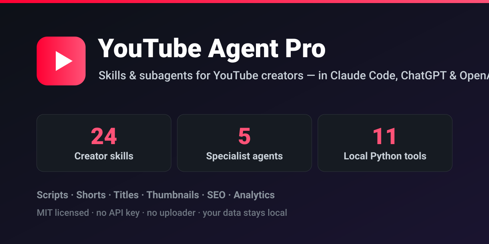
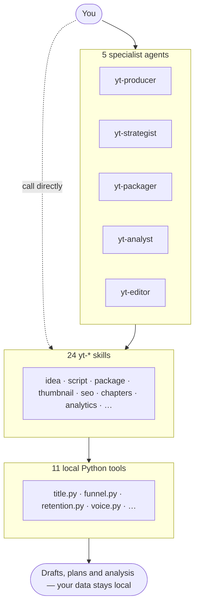
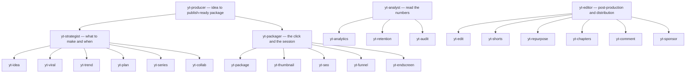

<p align="center">
  
</p>

# YouTube Agent Pro — YouTube Skills & Agents for Claude Code, ChatGPT & Codex

> **The open-source YouTube creator toolkit for AI assistants.** Write scripts, titles, thumbnails,
> SEO descriptions and Shorts — and read your own analytics — with 24 skills, 5 specialist subagents
> and 11 local Python tools. Runs in Claude Code, ChatGPT and OpenAI Codex. MIT, no API key.

[](https://github.com/ahmedsakri/youtube-agent-pro/actions/workflows/ci.yml)
[](LICENSE)
[](CONTRIBUTING.md)
[](#the-24-workflows)
[](#agents)
[](#choose-your-edition)
[](https://github.com/ahmedsakri/youtube-agent-pro/stargazers)

**One repository. 24 YouTube creator workflows per edition, 5 specialist Claude Code subagents, and 11 local Python tools — no API key required.**

Plan YouTube Shorts and long-form videos, write scripts and hooks, improve titles and thumbnail
concepts, draft accurate SEO descriptions, and analyze your own YouTube Analytics exports — in
Claude Code (skills **and** subagents), ChatGPT or OpenAI Codex. Delegate a whole video to an agent,
or call a single skill. Choose the Claude or OpenAI edition below; each has instructions written for
its host.

Free, MIT-licensed code. The Python tools need no API key or runtime packages. Your AI provider's
plan and available tools still apply. This pack creates drafts, plans and analysis; it does not
include a YouTube uploader, scheduling service, account connection or video renderer.

[Claude PDF guide](docs/guides/YouTube-Agent-Pro-Claude.pdf) ·
[ChatGPT & Codex PDF guide](docs/guides/YouTube-Agent-Pro-OpenAI.pdf) ·
[Download release files](https://github.com/ahmedsakri/youtube-agent-pro/releases/latest)

## Contents

- [Choose your edition](#choose-your-edition) — Claude Code, Codex, ChatGPT
- [The 24 workflows](#the-24-workflows) — every skill and what it returns
- [Agents](#agents) — 5 subagents that run whole workflows for you
- [How it fits together](#how-it-fits-together) — agents, skills and tools at a glance
- [YouTube SEO, with realistic expectations](#youtube-seo-with-realistic-expectations)
- [Local tools and creator context](#local-tools-and-creator-context)
- [FAQ](#faq)
- [Verification and maintenance](#verification-and-maintenance)
- [License](#license)

## Choose your edition

| Use it in | Location | How to ask |
| --- | --- | --- |
| Claude Code plugin | Root `skills/` and `.claude-plugin/` | `/youtube-agent-pro:yt` or `/youtube-agent-pro:yt-seo` |
| Claude Code, manually installed skills | Root `skills/` | `/yt` or `/yt-seo` |
| Claude Code subagents | Root [`agents/`](agents/README.md) | "Use the yt-producer agent to take this idea to a finished package" |
| OpenAI Codex | [`openai/`](openai/README.md) | `$yt` or `$yt-seo` |
| ChatGPT | [OpenAI instructions and workflow files](openai/chatgpt/README.md) | Ask naturally; use `@` for installed skills where supported |

### Claude Code

In Claude Code:

```text
/plugin marketplace add ahmedsakri/youtube-agent-pro
/plugin install youtube-agent-pro@youtube-agent-pro
/youtube-agent-pro:yt
```

Update the registered marketplace with `/plugin marketplace update youtube-agent-pro`.
Plugin skills use the plugin namespace. If you prefer manual installation, copy **all** root
`skills/yt*` folders into `~/.claude/skills/` or a project's `.claude/skills/`; those use `/yt`,
`/yt-script`, and so on. Check for existing names before copying. Use one route to avoid duplicates.

To use the **subagents**, copy the root `agents/yt-*.md` files into `~/.claude/agents/` (or a
project's `.claude/agents/`), then ask Claude to delegate — for example, *"Use the `yt-producer`
agent to take this idea to a publish-ready package."* Agents orchestrate the skills above, so install
both. See the [agents guide](agents/README.md) for the full list and conventions.

### OpenAI Codex

With Python 3.9 or later:

```bash
git clone https://github.com/ahmedsakri/youtube-agent-pro.git
cd youtube-agent-pro/openai
python3 scripts/install.py --dry-run
python3 scripts/install.py
```

Start a new Codex conversation and try:

```text
Use $yt-script to turn this outline into a 45-second English Short.
Use $yt-seo to write accurate title options and a unique description for this transcript.
Use $yt-analytics to review this export and explain what the numbers cannot establish.
```

The installer keeps all 24 skills together in `~/.agents/skills`, including their shared resources.
It refuses conflicts; an intentional update with `--force` first makes backups. A project-specific
destination and an alternative native plugin route are documented in the [OpenAI edition](openai/README.md).

### ChatGPT

Download `ChatGPT-INSTRUCTIONS.md` and `ChatGPT-WORKFLOWS.md` from the
[latest release](https://github.com/ahmedsakri/youtube-agent-pro/releases/latest). Add the instructions
to a conversation or project, attach the workflows and your source material, then ask for a result.
For computed scores, use the optional ChatGPT ZIP with a mode that can extract and execute Python.
Without execution, request a qualitative review. See [complete setup and capability limits](openai/chatgpt/README.md).

## The 24 workflows

Use the name below with your edition's invocation syntax, such as `/youtube-agent-pro:yt-script`
in the Claude plugin or `$yt-script` in Codex.

| Workflow | What you get |
| --- | --- |
| `yt` | Route a request or develop a complete video production package |
| `yt-voice` | An optional creator voice profile based on supplied transcripts |
| `yt-idea` | Relevant ideas and transparent heuristic comparisons |
| `yt-script` | Hooks, spoken scripts and retention beats |
| `yt-brief` | Shot lists, framing, graphics and production notes |
| `yt-edit` | Transcript-based edit decisions and dead-air suggestions |
| `yt-chapters` | Chapters checked for timestamp and formatting rules |
| `yt-package` | Accurate title and thumbnail-text pairings |
| `yt-thumbnail` | Visual concepts and a concept-level checklist |
| `yt-seo` | Video-specific descriptions, natural keywords and relevant tags |
| `yt-analytics` | Export analysis with missing evidence clearly identified |
| `yt-retention` | Retention curves, timecoded drops and testable editing ideas |
| `yt-funnel` | Channel page and subscriber-conversion review |
| `yt-audit` | A prioritized channel review grounded in supplied evidence |
| `yt-viral` | Public examples compared with each channel's own baseline |
| `yt-trend` | Sourced trend research and seasonal planning |
| `yt-series` | Series structure, playlist order and next-video connections |
| `yt-collab` | Audience-fit research and draft collaboration pitches |
| `yt-endscreen` | End-screen and card plans for eligible formats |
| `yt-shorts` | Standalone clip plans and new openings from supplied material |
| `yt-repurpose` | Platform-specific drafts from one source video |
| `yt-plan` | A calendar matched to your cadence, capacity and time zone |
| `yt-sponsor` | Illustrative rate scenarios, pitches and integration drafts |
| `yt-comment` | Comment triage, reply drafts and pin suggestions |

## Agents

The Claude edition also ships **5 specialist [agents](agents/README.md)** - subagents you can
delegate a whole workflow to. Each one orchestrates the skills above inside its own context rather
than duplicating them.

| Agent | Role | Orchestrates |
| --- | --- | --- |
| [`yt-producer`](agents/yt-producer.md) | End-to-end video production, idea to publish-ready package | yt, yt-idea, yt-script, yt-package, yt-thumbnail, yt-seo, yt-chapters, yt-brief |
| [`yt-strategist`](agents/yt-strategist.md) | What to make and when | yt-idea, yt-viral, yt-trend, yt-plan, yt-series, yt-collab |
| [`yt-packager`](agents/yt-packager.md) | The click and the session | yt-package, yt-thumbnail, yt-seo, yt-funnel, yt-endscreen |
| [`yt-analyst`](agents/yt-analyst.md) | Read the numbers, say what to fix first | yt-analytics, yt-retention, yt-audit |
| [`yt-editor`](agents/yt-editor.md) | Post-production and distribution | yt-edit, yt-shorts, yt-repurpose, yt-chapters, yt-comment, yt-sponsor, yt-voice |

Agents are a Claude Code feature; the ChatGPT and Codex edition continues to use the skills directly.

## How it fits together

Three layers: you talk to an **agent** (or call a **skill** directly); skills carry the instructions;
local **Python tools** do the scoring and number-crunching on your own data.



Each agent owns a slice of the channel and orchestrates the skills for it:



## YouTube SEO, with realistic expectations

Both editions ground titles and descriptions in the actual video, use one or two main topic terms
naturally, and write distinct descriptions for each upload. Tags have a limited role, especially for
misspellings; relevant hashtags remain optional. Shorts description URLs are not clickable, so
calls to action must match the destination available to viewers. These rules are based on
[YouTube's current metadata guidance](skills/yt-seo/references/youtube-metadata.md).

Search relevance and Shorts-feed recommendations are different. Low views alone cannot identify an
SEO problem, and no keyword list, thumbnail or posting time guarantees reach. The analytics workflow
distinguishes evidence from hypotheses and avoids applying long-form CTR rules to Shorts-feed views.

## Local tools and creator context

The 11 Python helpers cover idea and hook scoring, title and thumbnail-concept checks, funnel and
retention analysis, edit intervals, chapters, public-video comparisons, sponsorship scenarios and
transcript voice measurements. They operate on supplied data and make no network requests.

From the repository root, for example:

```bash
python3 skills/yt-package/title.py --title "Three Phone Cameras, One Dark Room" --thumb "WHICH WINS?" --json
python3 skills/yt-analytics/funnel.py --format shorts --avd 12 --length 30 --json
python3 skills/yt-retention/retention.py --help
```

Scores are editing aids, not predictions. Text heuristics are English-oriented; sponsorship bands
are illustrative USD assumptions. Use your language, audience data and verified deal terms to guide
decisions. A thumbnail concept is not a rendered image, and clip selection does not establish
permission to reuse the source footage.

Voice setup is optional. Supplied context comes first; Claude's default profile is
`~/.claude/youtube/voice.md`, while Codex uses a workspace `.youtube-agent/voice.md` when present.
ChatGPT uses attached profiles or conversation context. Keep private exports, credentials and
profiles out of this public repository.

## FAQ

**What is YouTube Agent Pro?**
An open-source (MIT) toolkit of 24 YouTube creator skills, 5 specialist Claude Code subagents and 11
local Python tools. It helps you plan videos and Shorts, write scripts, titles, thumbnail text and
SEO descriptions, and read your own YouTube Analytics — inside Claude Code, ChatGPT or OpenAI Codex.

**What is the difference between a skill and an agent?**
A skill is one workflow you invoke (for example `/yt-script`). An agent is a subagent you delegate a
whole job to — it decides which skills to run, in what order, and carries the work end to end in its
own context. Skills work in every edition; agents are a Claude Code feature.

**How do I install it in Claude Code?**
`/plugin marketplace add ahmedsakri/youtube-agent-pro` then `/plugin install
youtube-agent-pro@youtube-agent-pro`. For subagents, copy the `agents/yt-*.md` files into
`~/.claude/agents/`. See [Choose your edition](#choose-your-edition) for manual and Codex/ChatGPT
routes.

**Does it work with ChatGPT and OpenAI Codex?**
Yes. The [`openai/`](openai/README.md) edition ships 24 Codex skills, a portable plugin and a local
installer, plus reproducible ChatGPT instructions and workflow files.

**Do I need an API key or a paid plan?**
No API key. The Python tools run locally with no network calls or extra packages. Your own AI
provider's plan and available tools still apply.

**Will it upload or schedule videos, or manage my channel?**
No. It produces drafts, plans and analysis only. There is no uploader, scheduler, account connection
or video renderer, and your exports and credentials stay on your machine.

**Is it affiliated with YouTube, Anthropic or OpenAI?**
No. This is an independent, community-maintained project under the MIT license.

## Verification and maintenance

The editions share byte-identical Python helpers, checked by the repository validator. Regression
tests cover installation, packaging, missing data, CSV columns, retention axes, overlapping edits,
and execution from unrelated folders with spaces. See the [verification report](openai/docs/VALIDATION.md)
and [adaptation notes](openai/docs/PORTING_NOTES.md) for evidence and limits.

```bash
python3 -m venv .venv
.venv/bin/python -m pip install -r openai/requirements-dev.txt
.venv/bin/python scripts/validate_repo.py
.venv/bin/python openai/scripts/validate.py
.venv/bin/python -m unittest discover -s openai/tests -v
.venv/bin/python openai/scripts/build_release.py
```

CI runs on Python 3.9 and 3.12. PDF sources and rebuild instructions are in
[`docs/guides/`](docs/guides/README.md). This repository distributes community skills; publishing it
does not register a plugin in OpenAI's public directory or grant access to a YouTube account.

Contributions go through a pull request; see [CONTRIBUTING.md](CONTRIBUTING.md).

## License

[MIT](LICENSE). Maintained by Ahmed Sakri. Preserve the included copyright and permission notices
when redistributing. This is an independent project, not affiliated with YouTube, Anthropic or OpenAI.
